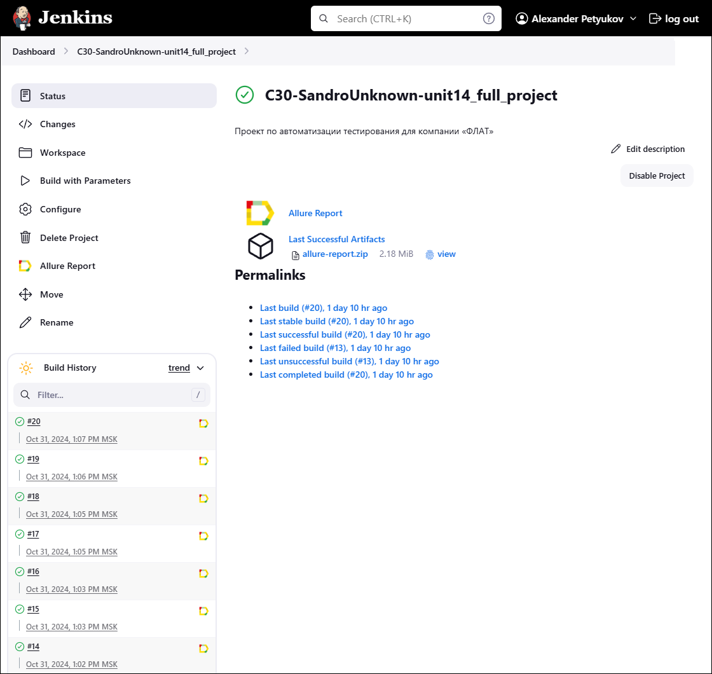
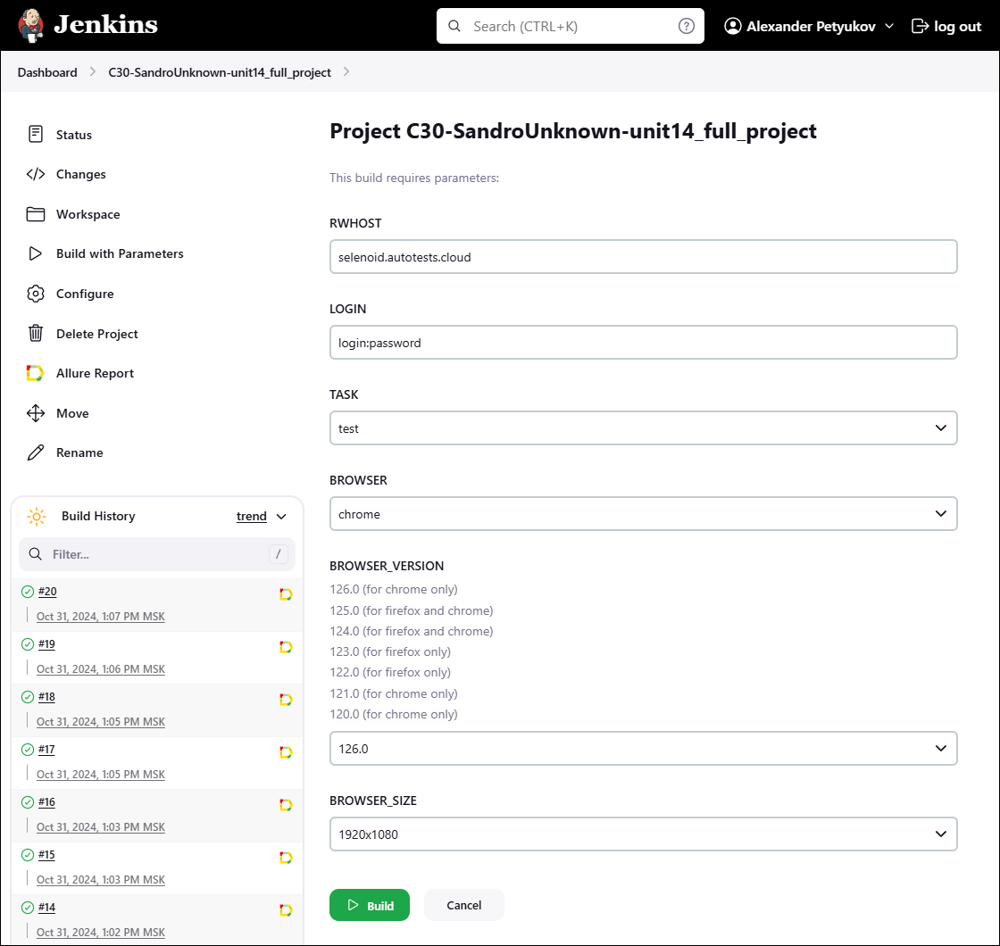

<a name="start"></a>
# Демонстрационный проект по автоматизации тестирования для компании [«ФЛАТ»](https://flat-soft.ru/)
</br></br>

> _**<p align="justify">[ООО «ФЛАТ»](https://flat-soft.ru/)** — российский разработчик линейки программных продуктов для организации современных корпоративных коммуникаций и оперативного взаимодействия на территориально-распределенных объектах.</p>_
> 
> _<p align="justify">Программное обеспечение ФЛАТ решает задачи по организации коммуникаций, приведения разрозненной инфраструктуры к единому централизованному стандарту, предоставляет сервисы оперативного и функционального контроля, учета и управления коммуникационными ресурсами, предлагая на российском рынке решения по записи переговоров, тарификации вызовов, централизованного управления парком телефонных аппаратов, а также продукты для развертывания современного контактного центра.</p>_
> 
> _<p align="justify">Программные решения компании включены в Реестр российских программ для электронных вычислительных машин и баз данных Минкомсвязи РФ.</p>_

</br>
</br>
</br>


<a name="table-of-contents"></a>
# Содержание

</br>


* [О проекте](#about)
  * [Для чего нужен проект](#for-what)
  * [Технологии и инструменты](#tools)
  * [Что делают тесты?](#tests)
* [Запуск тестов из терминала](#console)
  * [Параметры запуска](#console_params)
  * [Список возможных задач (TASK)](#console_tasks)
  * [Примеры запуска тестов](#console_example)
* [Интеграции и примеры](#integrations)
  * [Сборка в Jenkins](#jenkins)
  * [Интеграция с Allure Report](#allure-report)
  * [Интеграция с Allure TestOps](#allure-testops)
  * [Интеграция с Jira](#jira)
  * [Уведомление в Telegram при помощи бота](#telegram)
  * [Примеры видео выполнения тестов на Selenoid](#video)

</br>
</br>
</br>


<a name="about"></a>
# О проекте

</br>


<a name="for-what"></a>
### Для чего нужен проект

> _<p align="justify">Основная цель проекта — отработка навыков автоматизации тестирования, улучшение понимания процесса разработки тестов и повышение эффективности обеспечения качества программного обеспечения.</p>_
>
> _<p align="justify">Тестирование проводилось исключительно на уровне пользовательского интерфейса (UI), что позволяет сосредоточиться на взаимодействии пользователей с сайтом.</p>_
>
> _<p align="justify">Проект является демонстрационным и включает в себя ряд тестов, охватывающих различные аспекты функциональности, обеспечивая надежность и стабильность работы веб-приложения.</p>_
 
</br>
</br>


<a name="tools"></a>
### Технологии и инструменты

> <p align="left">  
> <a href="https://www.jetbrains.com/idea"></a>  
> <a href="https://www.java.com"></a>  
> <a href="https://junit.org/junit5"></a>  
> <a href="https://gradle.org"></a>  
> <a href="https://selenide.org"></a>
> <a href="https://github.com"></a>   
> <a href="https://www.jenkins.io"></a>  
> <a href="https://allurereport.org"></a>  
> <a href="https://qameta.io"></a>
> <a href="https://www.atlassian.com/software/jira"></a>
> <a href="https://telegram.org/"></a>
> <a href="https://aerokube.com/selenoid"></a>  
> </p>

</br>
</br>


<a name="tests"></a>
### Что делают тесты?

> Тесты проверяют разные страницы сайта на работоспособность и корректность данных.</br></br>
>
> **Общие тесты для всех страниц:**
>  - [x] Проверка наличия и корректности `телефона` и `email` в верхней части страницы;
>  - [x] Проверка наличия и корректности `контактных данных` в нижней части страницы;
>  - [x] Проверка всех пунктов (и подпунктов) главного `меню` на предмет корректности ссылок и наименований;</br></br>
>  
> **Тесты для главной страницы:**
>  - [x] Проверка содержимого страницы:
>    - [x] Проверка `слогана` компании;
>    - [x] Проверка `предоставляемых услуг`;</br></br>
>    
> **Тесты для страницы "партнеры":**
>  - [x] Проверка всех `партнеров` (по городам) на корректность данных `[параметризированный тест]`;
>  - [x] Проверка работы `поиска` партнера по имени `[параметризированный тест]`;
 
</br>
</br>
</br>


<a name="console"></a>
# Запуск тестов из терминала

</br>


<a name="console_params"></a>
### Параметры запуска

> Тесты можно запускать как с передачей параметров, так и без них (в этом случае тесты будут запущены с параметрами по умолчанию).
>
> | Параметр          | Описание                                                | Значение по умолчанию |
> | :---              | :---                                                    | :---                  |
> | `TASK`            | Имя задачи в Gradle (указывает какие тесты выполнить)   | test                  |
> | `REMOTE_URL`      | Адрес удалённого сервера, где будут запускаться тесты   | (локально)            |
> | `BASE_URL`        | Адрес сайта, где будут запускаться тесты                | https://flat-soft.ru  |
> | `BROWSER`         | Браузер, в котором будут выполняться тесты              | chrome                |
> | `BROWSER_VERSION` | Версия браузера, в которой будут выполняться тесты      | 125.0                 |
> | `BROWSER_SIZE`    | Размер окна браузера, в котором будут выполняться тесты | 1920x1080             |

</br>


<a name="console_tasks"></a>
### Список возможных задач (`TASK`)

> | Задача                      | Описание                                                                                                                                            |
> | :---                        | :---                                                                                                                                                |
> | `test`                      | Запускает `все` тесты</br> _(является значением по умолчанию)_                                                                                      |
> | `main_page`                 | Запускает тесты, `полностью` проверяющие только `главную страницу`                                                                                  |
> | `main_page_content_only`    | Запускает тесты, проверяющие `только контент` `главной страницы`</br> _(без проверки общих для сайта элементов, таких как меню, footer и topbar)_   |
> | `partner_page`              | Запускает тесты, `полностью` проверяющие только `страницу партнеров`                                                                                |
> | `partner_page_content_only` | Запускает тесты, проверяющие `только контент` `страницы партнеров`</br> _(без проверки общих для сайта элементов, таких как меню, footer и topbar)_ |
> | `smoke`                     | Запускает тесты, проверяющие `topbar и footer` `на всех страницах`                                                                                  |
> | `top_bar`                   | Запускает тесты, проверяющие `только topbar` `на всех страницах`                                                                                    |
> | `footer`                    | Запускает тесты, проверяющие `только footer` `на всех страницах`                                                                                    |
> | `top_menu`                  | Запускает тесты, проверяющие `только menu` `на всех страницах`                                                                                      |

</br>


<a name="console_example"></a>
### Примеры запуска тестов

> **Локальный запуск (без параметров)**
> ```
> gradle clean test
> ```
>
> </br>
>
> **Удаленный запуск (с параметрами)**
> ```
> clean
> -Dtask="${TASK}"
> -DremoteUrl="${REMOTE_URL}"
> -DbaseUrl="${BASE_URL}"
> -Dbrowser="${BROWSER}"
> -DbrowserVersion="${BROWSER_VERSION}"
> -DbrowserSize="${BROWSER_SIZE}"
> ```

</br>
</br>
</br>


<a name="integrations"></a>
# Интеграции и примеры

</br>


<a name="jenkins"></a>
### Сборка в Jenkins

> Реализован запуск тестов с помощью [Jenkins](https://jenkins.autotests.cloud/job/!!!!!!!!!!!!!!!!!!!!!!!!!!!!!!!!/) (требуется авторизация).
> </br></br>
> Для запуска сборки необходимо: 
> 1. Перейти в раздел `▷ Build with Parameters`
> 2. Выбрать необходимые [параметры](#console_params)
> 3. Нажать кнопку `▷ Build`
>
> <p>  
> 
> 
> </p>
>
> После выполнения сборки в разделе `🔆 Build History` можно будет детатьно изучить прошедние тесты:
> * Посмотреть лог
> * Посмотреть [   Allure Report](#allure)
> * Посмотреть [   Allure TestOps](#allure-testops)

</br>
</br>


<a name="allure-report"></a>
### Allure Report

После выполнения тестов можно посмотреть отчет в [Allure](https://jenkins.autotests.cloud/job/!!!!!!!!!!!!!!!!!!!!!!!!!!!!)
</br> На скриншоте один из результатов выполнения тестов:


</br>
</br>


<a name="llure-testops"></a>
### Allure TestOps
Просто текст:  
- Текст 1
- Текст 2
- Текст 3
</br>
</br>


<a name="jira"></a>
### Интеграция с Jira
Просто текст:  
- Текст 1
- Текст 2
- Текст 3
</br>
</br>


<a name="telegram"></a>
### Уведомление в Telegram при помощи бота
После выполнения отчета результат так же предоставит бот в Telegram:
<p align="center">
    
</p>
</br>
</br>


<a name="video"></a>
### Примеры видео выполнения тестов на Selenoid
Просто текст:  
- Текст 1
- Текст 2
- Текст 3
</br>
</br>


---
---
---


> [!NOTE]
> Useful information that users should know, even when skimming content.

> [!TIP]
> Helpful advice for doing things better or more easily.

> [!IMPORTANT]
> Key information users need to know to achieve their goal.

> [!WARNING]
> Urgent info that needs immediate user attention to avoid problems.

> [!CAUTION]
> Advises about risks or negative outcomes of certain actions.


| Left-aligned | Center-aligned | Right-aligned |
| :---         |     :---:      |          ---: |
| git status   | git status     | git status    |
| git diff     | git diff       | git diff      |


<details>
<summary>Tips for collapsed sections</summary>
  бла
  бла 
  бла
<details>


